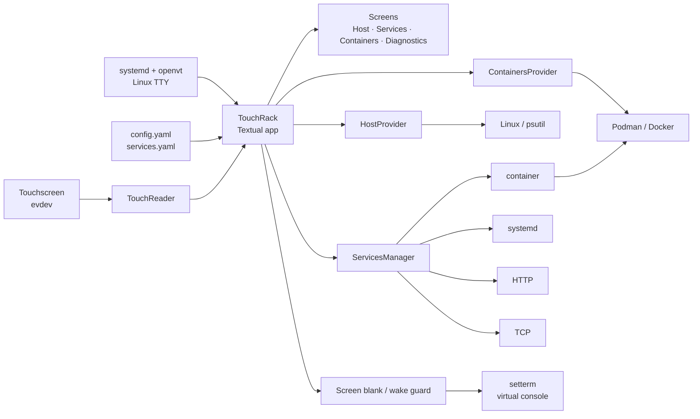

# TouchRack

**A touch-first, modular homelab console for physical Linux TTY displays.**

It is designed for small directly attached displays — the reference setup is a
7-inch 1024×600 panel running as a **64×18 virtual console** — with no X11,
Wayland, browser or desktop environment required.

The application is built with [Textual](https://textual.textualize.io/) and
reads the touchscreen directly through Linux `evdev`.

> Current baseline: **v4.6.2**. Read-only by design.

<!-- Add a real 64x18 photo/screenshot here before publishing the repository. -->

## What it shows

- **Host** — CPU, memory, disk and temperature at a glance.
- **Services** — up to six curated checks from containers, systemd, HTTP or TCP.
- **Containers** — Podman/Docker summary, resource hotspots and container detail.
- **Diagnostics** — runtime display, touch, engine, services, config and sleep state.
- **Touch wake guard** — the first touch wakes a blanked display without activating
  the control underneath it.

The UI automatically switches to the dedicated `compact-touch` layout on small
terminals such as the reference **64×18** console.

## Requirements

- Linux with virtual consoles (`/dev/ttyN`)
- Python **3.11+**
- a Unicode-capable Linux console font
- `kbd` tools (`openvt`, `setfont`, `setterm`)
- optional touchscreen exposed through `/dev/input/event*`
- Podman or Docker only if container monitoring is wanted

The reference Ubuntu setup uses:

```text
/dev/tty1
Uni3-Terminus32x16.psf.gz
1024×600 → 64×18 cells
```

No X11, Wayland or browser is required.

## Install

Clone the repository and create a virtual environment:

```bash
python3 -m venv .venv
.venv/bin/pip install -e .
```

Create local configuration from the examples:

```bash
cp config.example.yaml config.yaml
cp services.example.yaml services.yaml
```

For a quick manual TTY test:

```bash
sudo systemctl stop getty@tty1.service

sudo openvt -c 1 -f -s -- \
  env LANG=C.UTF-8 LC_ALL=C.UTF-8 PYTHONUTF8=1 TERM=linux \
  "$(pwd)/.venv/bin/homelab-console"
```

For normal boot-time use, install the supplied systemd unit:

```bash
sudo ./scripts/install-systemd.sh
sudo systemctl enable --now homelab-touch-console.service
```

Check it with:

```bash
systemctl status homelab-touch-console.service
journalctl -u homelab-touch-console.service -b
```

The versioned service intentionally launches through:

```text
openvt -c 1 -f -s -w
```

This is the startup mode validated on the reference physical console.

## Configuration

`config.yaml` is optional. Lookup order is:

1. `HOMELAB_CONFIG`
2. `./config.yaml`
3. `~/.config/homelab-console/config.yaml`
4. built-in defaults

Example:

```yaml
display:
  tty: /dev/tty1
  sleep: 1m

refresh:
  seconds: 30

touch:
  enabled: true
  device: auto

services:
  file: services.yaml
```

Supported sleep values are `1m`, `5m`, `15m` and `on`.

`touch.device: auto` discovers the touchscreen automatically; an explicit
`/dev/input/eventX` path may also be used.

## Services

`SERVICES` is a curated dashboard rather than another inventory. Define the
things that matter in `services.yaml`:

```yaml
services:
  - id: dashboard
    title: Dashboard
    provider: container
    target: dashboard
    metric: memory
    pinned: true
    priority: 10

  - id: web
    title: Web
    provider: http
    target: http://127.0.0.1:8080/health
    expect: 200
    timeout: 2
    pinned: true
    priority: 20
```

Available providers:

| Provider | Check |
| --- | --- |
| `container` | Podman/Docker state and optional CPU/memory metric |
| `systemd` | `systemctl is-active` |
| `http` | HTTP status |
| `tcp` | TCP connection to `host:port` |

Every provider is normalized to the same UI states:
`OK`, `IDLE`, `WARN`, `ERROR`, `UNKNOWN`.

Provider failures do not bring down the dashboard; they are represented as
service state instead.

## Architecture



The key boundary is simple: **screens consume models/state; providers know how
to obtain it**. UI code does not need to know whether a service came from
systemd, a container, HTTP or TCP.

The project is intentionally **read-only by default**. Monitoring failures
should degrade to `UNKNOWN`/`ERROR`, not crash the interface.

## Project layout

```text
src/homelab_console/  # internal Python package
├── app.py               application coordination and navigation
├── config.py            application configuration
├── models.py            host/container state models
├── providers/           host and container data providers
├── screens/             Host, Services and Containers UI
├── services.py          service registry/providers/normalization
├── touch.py             direct evdev touchscreen input
├── screen_blank.py      Linux VC sleep/wake helpers
├── single_instance.py   single-instance lock
└── console.tcss         Textual stylesheet
```

## Development

Install development dependencies:

```bash
.venv/bin/pip install -e '.[dev]'
```

Run the suite:

```bash
.venv/bin/pytest
```

The UI smoke tests use Textual's test driver at the physical target size
(**64×18**) so stylesheet/parser regressions are caught before deployment.

`CORE-LOGIC-SHA256.txt` records the known-good hashes of the sensitive touch,
blanking and single-instance modules.

## Local files

These are intentionally not versioned:

```text
config.yaml
services.yaml
.venv/
```

Start from `config.example.yaml` and `services.example.yaml` instead.
